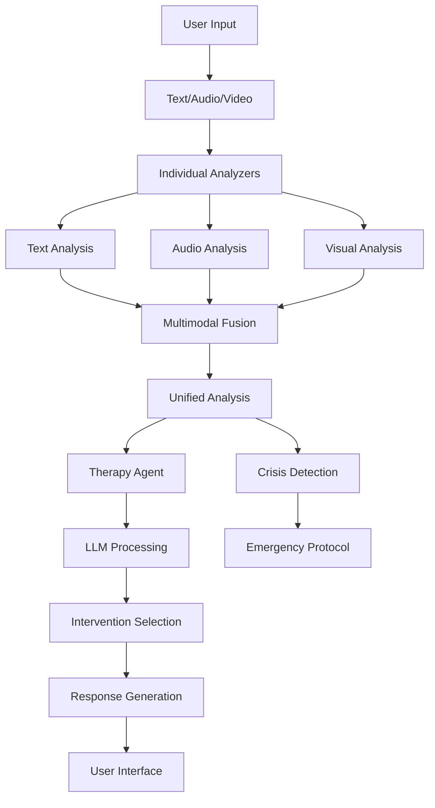

# Multimodal AI Therapy System - Project Structure & Implementation Plan

## Project Overview
**Title:** Agentic AI for Personalized Mental Health Therapy Recommendations via Multimodal Sentiment Analysis

**Goal:** Build an autonomous AI system that provides personalized mental health support through real-time analysis of text, audio, and visual inputs, delivering evidence-based therapeutic interventions.

---

## Current Project Structure

```
project/
├── app.py                    # Main Streamlit application (needs enhancement)
├── sentiment_analyzer.py     # Text analysis (being replaced with enhanced version)
├── audio_analyzer.py        # Voice analysis (needs real models)
├── visual_analyzer.py       # Facial/body analysis (needs enhancement)
├── multimodal_fusion.py     # Combines all modalities (needs improvement)
├── therapy_agent.py         # Therapeutic responses (needs LLM integration)
├── privacy_manager.py       # Empty - to be implemented
├── models/                  # Model storage directory
├── session_data/           # Session recordings
├── audio_data/             # Audio recordings
├── video_data/             # Video recordings
├── multimodal_profiles/    # User profiles
└── logs/                   # System logs
```

---

## Implementation Phases

### Phase 1: Core Model Integration ✅ (In Progress)
**Timeline:** Weeks 1-2
**Status:** Started with sentiment_analyzer.py

#### 1.1 Text Analysis Enhancement ✅
- [x] Replace rule-based sentiment with real models
- [x] Integrate Hugging Face mental health models
- [x] Add crisis detection with severity levels
- [x] Extract clinical topics
- [ ] Test with real therapy transcripts

#### 1.2 Audio Analysis Enhancement 🔄
- [ ] Replace rule-based with speech emotion models
- [ ] Integrate `wav2vec2` for emotion recognition
- [ ] Add prosody analysis models
- [ ] Enhance voice stress detection
- [ ] Keep Whisper for transcription

#### 1.3 Visual Analysis Enhancement 📋
- [ ] Add facial emotion recognition models
- [ ] Enhance micro-expression detection
- [ ] Improve body language interpretation
- [ ] Add attention/engagement tracking
- [ ] Integrate with MediaPipe (keep existing)

---

### Phase 2: Intelligence Layer
**Timeline:** Weeks 3-4

#### 2.1 LLM Integration
- [ ] **Option A: Groq API**
  - Llama 3.1 70B for therapy responses
  - Mixtral for reasoning
  - Fast inference, low cost
  
- [ ] **Option B: Local Ollama**
  - Llama 3.1 8B/13B
  - Complete privacy
  - Slower but controlled

#### 2.2 Therapy Response Generation
- [ ] Context-aware responses
- [ ] Technique selection based on analysis
- [ ] Session memory management
- [ ] Personalized interventions

---

### Phase 3: Multimodal Fusion Enhancement
**Timeline:** Weeks 5-6

#### 3.1 Advanced Fusion
- [ ] Temporal analysis (emotions over time)
- [ ] Cross-modal validation
- [ ] Confidence-weighted fusion
- [ ] Contradiction detection
- [ ] Pattern recognition

#### 3.2 Real-time Processing
- [ ] Stream processing pipeline
- [ ] Synchronization across modalities
- [ ] Buffering and batching
- [ ] Latency optimization

---

### Phase 4: Agentic Capabilities
**Timeline:** Weeks 7-8

#### 4.1 Autonomous Decision Making
- [ ] Proactive intervention timing
- [ ] Goal-directed therapy planning
- [ ] Multi-session strategy
- [ ] Outcome prediction

#### 4.2 Personalization Engine
- [ ] User profile learning
- [ ] Trigger pattern detection
- [ ] Intervention effectiveness tracking
- [ ] Adaptive recommendation system

#### 4.3 Crisis Management
- [ ] Multi-level risk assessment
- [ ] Escalation protocols
- [ ] Emergency integration
- [ ] Follow-up scheduling

---

## Technical Components

### Models Being Integrated

#### Text Analysis Models
```python
# Mental Health
- rabiaqayyum/autotrain-mental-health-analysis
- paulagarciaserrano/roberta-depression-detection
- gooohjy/suicidal-BERT (use with caution)

# Emotions
- SamLowe/roberta-base-go_emotions (28 emotions)
- j-hartmann/emotion-english-distilroberta-base

# Clinical Sentiment
- nlptown/bert-base-multilingual-uncased-sentiment
```

#### Audio Analysis Models (To Add)
```python
# Speech Emotion
- superb/wav2vec2-base-superb-er
- ehcalabres/wav2vec2-lg-xlsr-en-speech-emotion-recognition

# Voice Analysis
- facebook/wav2vec2-large-xlsr-53
- openai/whisper-base (transcription)
```

#### Visual Analysis Models (To Add)
```python
# Facial Emotion
- trpakov/vit-face-expression
- SSI-DNN/facial-emotion-recognition-ferplus

# Body Language
- Keep MediaPipe for landmarks
- Add custom interpretation layers
```

### LLM Options

#### Groq (Recommended for Speed)
```python
Models:
- llama-3.1-70b-versatile
- llama-3.1-8b-instant
- mixtral-8x7b-32768
```

#### Ollama (For Privacy)
```python
Models:
- llama3.1:8b
- llama3.1:13b
- mistral:7b
```

---

## Data Flow Architecture



---

## Key Features to Implement

### Core Functionality
- [x] Basic UI with Streamlit
- [x] Privacy consent flow
- [ ] Real-time multimodal processing
- [ ] Clinical-grade analysis
- [ ] Evidence-based interventions
- [ ] Crisis detection and response

### Advanced Features
- [ ] Temporal emotion tracking
- [ ] Personality modeling
- [ ] Therapy goal tracking
- [ ] Outcome measurement
- [ ] Session continuity
- [ ] Progress visualization

### Safety Features
- [x] Crisis keyword detection
- [ ] Graduated risk assessment
- [ ] Emergency service integration
- [ ] Session logging
- [ ] Audit trails
- [ ] Fallback protocols

---

## Installation Requirements

### Base Requirements
```bash
# Core
pip install streamlit pandas numpy

# NLP/ML
pip install transformers torch sentencepiece
pip install nltk textblob vaderSentiment

# Audio
pip install librosa sounddevice soundfile
pip install openai-whisper speechrecognition

# Video
pip install opencv-python mediapipe
pip install pillow

# LLM
pip install groq  # For Groq API
pip install ollama  # For local models
```

### Hardware Requirements
- **Minimum:** 8GB RAM, CPU only
- **Recommended:** 16GB RAM, GPU with 8GB VRAM
- **Optimal:** 32GB RAM, GPU with 16GB+ VRAM

---

## Development Roadmap

### Immediate Next Steps (This Week)
1. ✅ Replace sentiment_analyzer.py with enhanced version
2. 🔄 Test enhanced text analysis
3. 📋 Integrate LLM for therapy responses
4. 📋 Update app.py for new components

### Short Term (Next 2 Weeks)
1. Enhance audio analyzer with real models
2. Improve visual analyzer
3. Implement temporal analysis
4. Add user profiling

### Medium Term (Next Month)
1. Build agentic decision layer
2. Add intervention planning
3. Implement outcome tracking
4. Create admin dashboard

### Long Term (3+ Months)
1. Clinical validation
2. Security audit
3. HIPAA compliance
4. Production deployment

---

## Testing Strategy

### Unit Testing
- Individual model performance
- Crisis detection accuracy
- Fusion algorithm validation

### Integration Testing
- Multimodal synchronization
- End-to-end pipeline
- Response generation

### Clinical Testing
- Therapy technique appropriateness
- Crisis response validation
- Outcome measurement

---

## Deployment Options

### Local Deployment
- Ollama for LLM
- All processing on-device
- Maximum privacy

### Cloud Deployment
- Groq/OpenAI for LLM
- Scalable processing
- Better model quality

### Hybrid Deployment
- Critical processing local
- LLM in cloud
- Balance of privacy/performance

---

## Current Status Summary

### What's Working
- Basic UI structure ✅
- Consent flow ✅
- MediaPipe integration ✅
- Basic multimodal framework ✅

### What's Being Fixed
- Text analysis (replacing now) 🔄
- Real model integration 🔄
- Crisis detection enhancement 🔄

### What's Not Working
- Audio emotion detection (rule-based)
- Visual emotion recognition (rule-based)
- No actual LLM integration
- No real personalization
- No temporal analysis

---

## Risk Considerations

### Technical Risks
- Model size vs performance tradeoff
- Real-time processing challenges
- Multimodal synchronization issues

### Clinical Risks
- False positive/negative crisis detection
- Inappropriate intervention selection
- Lack of clinical validation

### Ethical Considerations
- User data privacy
- Crisis response liability
- Clinical scope limitations
- Bias in models

---

## Success Metrics

### Technical Metrics
- Response latency < 2 seconds
- Crisis detection accuracy > 90%
- Multimodal fusion confidence > 0.8

### Clinical Metrics
- Appropriate intervention selection
- User engagement tracking
- Outcome improvement measurement

### User Metrics
- Session completion rate
- User satisfaction scores
- Return user rate

---

## Next Action Items

1. **Today:** Complete sentiment_analyzer.py replacement
2. **Tomorrow:** Test with sample inputs
3. **This Week:** Add LLM integration
4. **Next Week:** Enhance audio/visual analyzers

---

## Questions to Resolve

1. **LLM Choice:** Groq (speed) vs Ollama (privacy)?
2. **Deployment:** Local vs Cloud vs Hybrid?
3. **Crisis Handling:** Detection only or active intervention?
4. **Data Storage:** How to handle session data?
5. **Clinical Validation:** How to validate interventions?